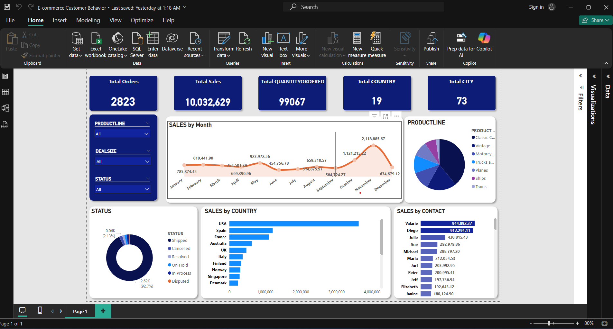

# 📊 E-commerce Customer Behavior Analysis Dashboard

This project provides a Power BI dashboard analyzing customer purchasing behavior using real-world e-commerce sales data.

---

## 📁 Dataset

The dataset includes detailed information about:
- Orders (Order Number, Date, Quantity, Price, Sales)
- Products (Product Line, Code, MSRP)
- Customers (Name, Country, Territory, Contact Info)
- Location data (City, State, Postal Code)

Data was cleaned and structured in Excel before visualization.

---

## 📈 Dashboard Insights

The dashboard includes the following insights:

- 🌍 **Number of countries** where products are sold
- 📅 **Monthly Sales Trend**
- 🧑‍💼 **Sales by Contact Person**
- 🗺️ **Sales by Country**
- 📌 **KPIs** including:
  - Total Sales
  - Number of Orders
  - Average Sales per Order
  - Number of Countries

All visuals are interactive and support filtering for deeper insights.

---

## 🛠 Tools Used

- **Excel**: Data cleaning and initial processing
- **Power BI**: Data modeling and visualization

---

## 📸 Dashboard Preview

  

---

## 🧠 Key Learnings

- Practice with real-life e-commerce data
- Hands-on Power BI skills including:
  - Slicers and filters
  - Data transformations in Power Query
  - KPIs and DAX formulas
  - Map and card visualizations

---

## 📂 How to Use

1. Clone this repository
2. Open the `.pbix` file using Power BI Desktop
3. Interact with the dashboard freely

---

## ✅ Author

**Moatazbellah Emad Ismael**  
Find me on [LinkedIn](https://www.linkedin.com/in/moataz-ismael/)

---

## ⭐️ Give it a star if you liked it!
